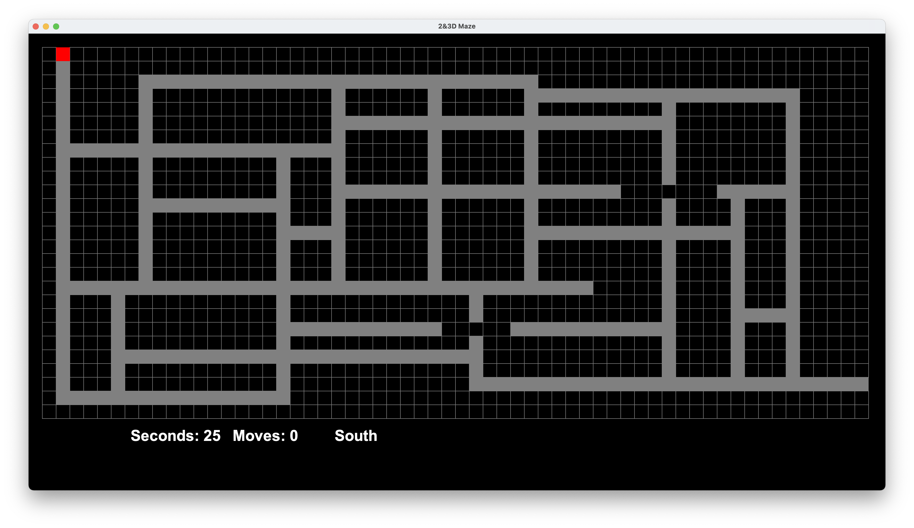
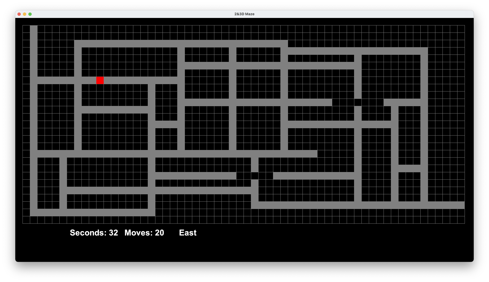
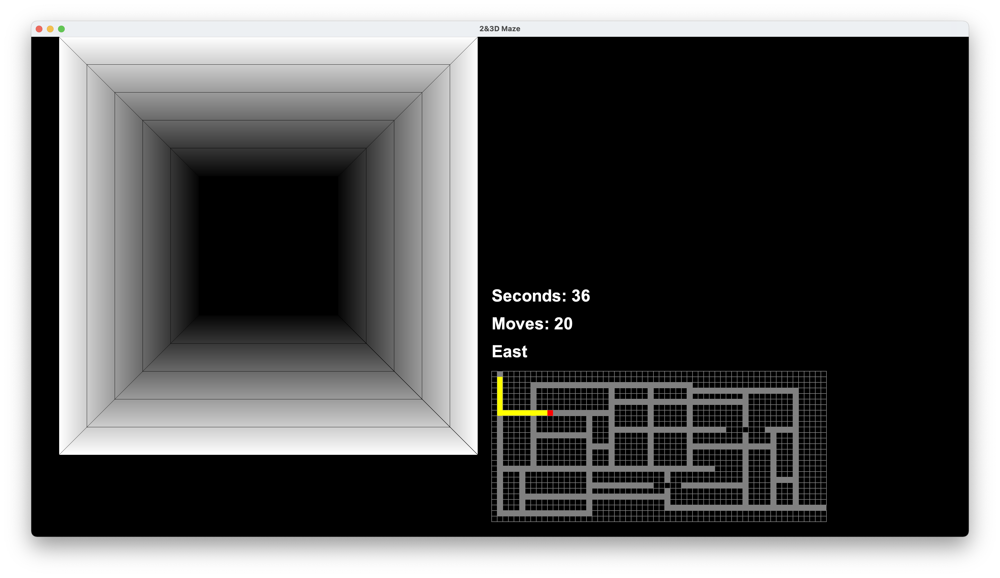
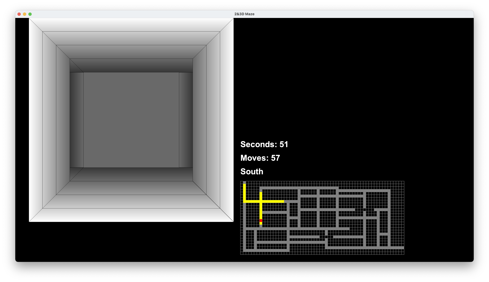
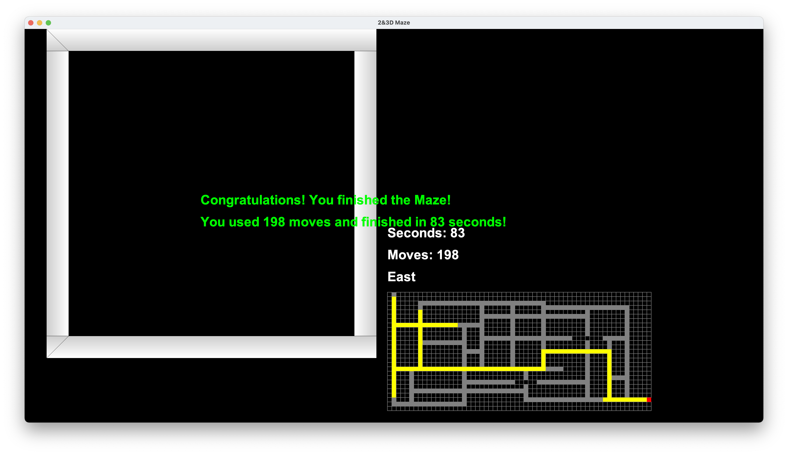

# 2D & 3D Maze
A 2D and 3D Maneuverable Maze styled in the format of a game. Written in Java, this program features Java Swing and JFrame for GUI Purposes. 

## Summary
This program is a Maze with an extra dimension added to it: 3D functionality. The user can navigate through the maze using their conventional arrow keys (with directional movement) via a 2D or 3D GUI. 

## How it works
Reading a text file of an ASCII Maze, the program then differentiates the '#'(Hashes) with the ' '(Spaces) in order to replicate the maze onto the JFrame. After doing so, the program utilizes various GUI elements from JFrame's Library in order to reconstruct the maze into both 2D and 3D formats. With the use of conditionals and methods, the program then implements a competitive aspect, featuring a move counter, timer, and trail, also enhancing the user experience. 

## Program in Action
Below are images of the application in action, highlighting various "game modes" and features implemented in the program.

## Dependencies Utilized
- Java
- JFrame
